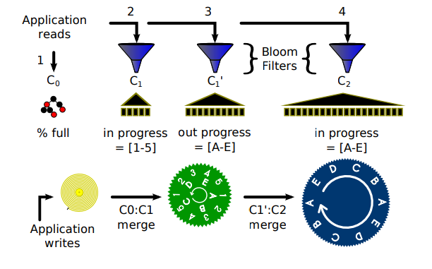

# Strange Points
## Questions

### Why using append only model in memory?

> Maybe just to access it quicker, but also may be the partition decesion of LevelDB. The partitioned exponential file for database storage management: https://dl.acm.org/citation.cfm?id=1285907

### Why using Skiplist, not Hashmap?
> FaceBook RocksDB had gave out the results. https://github.com/facebook/rocksdb/wiki/MemTable#comparison

### About Level 0
> RocksDB's wiki tells the compaction of L0 is the main bottleneck that will slow down the entire system https://github.com/facebook/rocksdb/wiki/Leveled-Compaction

#### About other Level
> Rocks DB provide parrel Compaction and sub Compaction Tiering and Dynamic compaction to control the balance Merge Operation to gather a range of keys

----
# Disadvantages and their causes
## Write Amplification
> Rewrite and Repeating for many times
Solutions in the industry:
- Leveraging write skew

## Read Amplification
__Should notice that LSM based structure always sacrifies Read performance as the the trade of sequencial writes__
> Limiting read amplification for frequently updated data

there is a fractal tree http://mysql.taobao.org/monthly/2016/04/09/

> Insert if not exists (widely used in many database engine, but _WHY NOT LEVELDB????_, it can not be a contribution, but it is very strange)

## Write Pauses
> temporaily disable the compaction process

> Partitioned Exponential Files

The partitioned exponential file for database storage management https://dl.acm.org/citation.cfm?id=1285907

The basic idea of this partition is to make the worst case's burden is not that big to impact the system.

----
## Solutions
### Memtable Modifications
> B-SkipList
### Compaction Process Modification
> bLSM
- Gear Schedular

The general purpose of this paper is focusing on the factors between compaction process in different layouts.

## Basic Improvement Ideas:

- Range Query Improve
- Seek Based Compactio (Level DB implemented
    - Parrel Seeks
- Read Improving
    - Bloom Filter

## Experiment About:

----
# LSM basic
## Usage of LSM
- Key Value Store _LevelDB & RocksDB_
- Graphic Database _Dgraph(Java)_
- Task Queue _Cherami_
- Streaming Processing _Apache Flink_
- Data Warehouse _Hbase_

## Basic Operations
- Get
- Put and Update
- Iterators
    - seek
    - next
    - value
- Range Query

## About Hot Data
> Five Minutes Rule: https://dl.acm.org/citation.cfm?id=271094

## Design Principles on Flash Device:
1. Transforming random writes into sequential ones. We should take advantage of sequential writes, and avoid the random writes by designing sophisticated data structures. 
2. Limiting random writes within a small region. Previous studies [4, 6] reported that random writes on flash SSDs with a small area (512KB-8MB) have a comparable performance to sequential writes. 
3. Supporting multi-page I/O optimization. Accessing multiple pages in an I/O operation is more efficient than accessing each page separately.